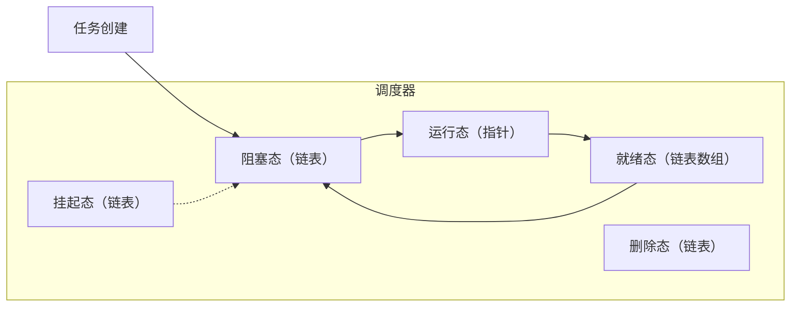
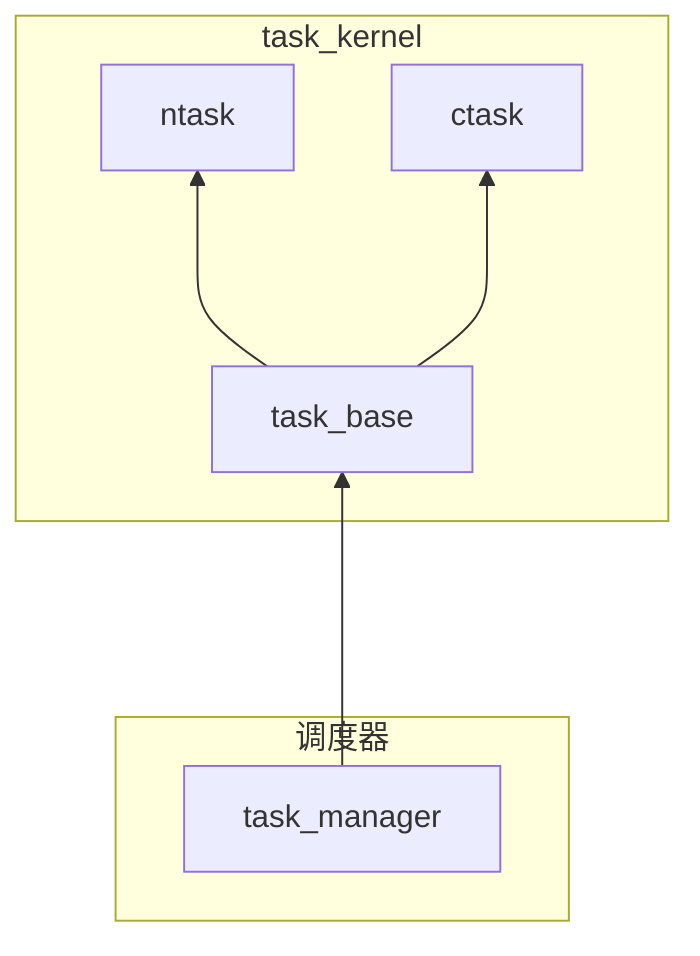

# xf_task 协作式任务调度器

## 介绍 xf_task

### 背景

在嵌入式系统中，任务调度是系统运行的核心，常见的调度方式有抢占式调度和协作式调度。抢占式调度是大多数实时操作系统（RTOS）采用的方式，能够中断正在运行的任务切换到优先级更高的任务，适用于对实时性要求高的场景，但实现较为复杂，容易引发资源竞争和任务切换问题。相比之下，协作式调度在任务主动让出CPU控制权时进行切换，虽然在某些情况下可能导致任务阻塞，但其实现简单、切换开销小，更容易避免资源竞争问题。尽管市面上绝大多数RTOS以抢占式调度为主，但在许多低功耗和资源受限的场景中，协作式调度的优势往往更加重要。为满足这些需求，xf_task 作为一款开源的协作式任务调度器应运而生。xf_task 实现了两种协程机制：ntask（无栈协程）和 ctask（有栈协程），前者采用轻量级设计，非常适合资源受限的嵌入式设备，而后者提供了更强的灵活性，支持复杂任务流程。xf_task 具有高度的可移植性，能够适用于裸机环境，也可以与多线程系统集成，是一款功能强大且易于使用的协作式调度器。

### 功能

1. 协作式调度，支持裸机移植，支持多线程中构造多调度器
2. 支持两种任务，ntask （定时任务、无栈协程）、ctask （有栈协程）
3. 移植简单，ntask 仅需对接时间戳的获取。ctask 对接上下文的创建和切换函数（可通过宏屏蔽）
4. 支持协作式任务优先级
5. 支持消息队列，ctask 支持专属超时消息队列（消息队列可以设置超时时间）
6. 支持任务触发机制
7. 支持紧急任务
8. 支持任务饥饿值机制
8. 支持 mbus 发布订阅机制
10. 支持任务池机制

### 文件夹介绍

```c
.
├── example
│  ├── ctask            # 使用 ctask 例程
│  ├── ctask_queue      # 使用 ctask 专属超时消息队列例程
│  ├── hunger           # 任务饥饿值例程
│  ├── mbus             # mbus 消息发布订阅例程
│  ├── ntask            # 基础 ntask 例程
│  ├── ntask2           # ntask 无栈协程例程
│  ├── priority         # 优先级例程
│  ├── task             # ctask ntask混用例程
│  ├── task_pool        # 任务池例程
│  ├── trigger          # trigger 触发任务例程
│  └── urgent           # 优先级例程
├── port
│  ├── asm          # 不同架构的保存上下文汇编实现（来自boost）
│  ├── README.md    # 对接的简单说明文档
│  ├── port.c       # linux 对接实现
│  └── port.h       # linux 对接声明
├── src
│  ├── kernel       # xf_task 核心部分,包含调度器和任务基类
│  ├── port         # 对接部分，对接外部的回调函数
│  ├── task         # 各种 task 类部分
│  ├── utils        # 队列，mbus等通讯类部分
│  ├── xf_task.h    # 对外统一的头文件
│  └── xf_task_config_internal.h    # 内部使用的配置文件（依赖外部的 xf_task_config）
├── README.md       # 说明文档
└── xmake.lua       # xmake 构建脚本
```

### 原理解析

#### 调度器原理

##### 调度器示意图

##### 调度器调度过程

在 xf_task 调度系统中，任务的基本类型是 task_base，无论是 ntask 还是 ctask 都继承自 task_base。任务的调度流程如下：

1. 阻塞态：

- 任务首先进入阻塞态。在这个状态中，调度器会调用 task_base 的 update 虚函数（由具体的子类实现）来更新任务的信号。
- 调度器在执行完 update 后，会检查任务是否有信号。如果任务有信号，则会从阻塞态转移到就绪态。
    - 对于 ntask，此时会执行相应的延时操作。
    - 对于 ctask，由于其初始延时为 0，因此会立即向调度器发送信号并切换到就绪态。
2. 就绪态：

- 在就绪态中，任务会按照其优先级挂载到不同的等级中。调度器会遍历各个优先级等级，高优先级的任务会先被查询。如果没有高优先级任务，则会查询次高优先级任务，以此类推。
- 一旦找到一个任务，调度器会将该任务从就绪态转移到运行态，并执行该任务的函数。
3. 运行态：
- 任务在运行完成后，调度器会将运行态的函数指针设置为 NULL，然后将任务重新加入阻塞态，再次进入调度循环。
    - 对于 ntask，调度器会直接调用任务的函数执行。
    - 对于 ctask，调度器会恢复任务上下文到之前执行的位置。参与正常的调度循环，但与此同时，延时的时间也不会算入进去。直到用户将挂起态的任务提溜出来。该任务才会进入阻塞态，重新进入调度循环。
5. 删除态：
- 当需要删除任务时，任务首先会被放入“监狱”中，暂时不会参与调度。调度器会在有空闲时间时统一处理这些任务，将其销毁。

#### 对象以及继承关系



**task_manager 对象**：位于kernel文件夹内，用于调度任务的运行。默认有default_manager。不同线程中可以创建独立的 task_manager 对应的函数都有 xxx_with_manager 版本。

```c
typedef struct _xf_task_manager_handle_t {
    xf_task_t current_task;                         /*!< 当前执行任务 */ 
    xf_task_t urgent_task;                          /*!< 紧急任务 */
    xf_list_t ready_list[XF_TASK_PRIORITY_LEVELS];  /*!< 任务就绪队列 */
    xf_list_t blocked_list;                         /*!< 任务阻塞队列 */
    xf_list_t suspend_list;                         /*!< 任务挂起队列，挂起任务不参与调度，需要手动恢复 */
    xf_list_t destroy_list;                         /*!< 任务销毁队列，进行异步销毁 */
    xf_task_on_idle_t on_idle;                      /*!< 空闲任务回调 */
#if XF_TASK_HUNGER_IS_ENABLE
    xf_list_t hunger_list;                          /*!< 任务饥饿队列，达到其指定值进行跳跃 */
#endif // XF_TASK_HUNGER_IS_ENABLE
#if XF_TASK_CONTEXT_IS_ENABLE
    xf_task_context_t context;                      /*!< 调度器上下文 */
#endif // XF_TASK_CONTEXT_IS_ENABLE
} xf_task_manager_handle_t;
```

**task_base 对象**：提供了所有task的公共部分。其中比较重要的是这里定义了一个虚函数表 constructor, reset, update, exec。这就是每个子对象需要实现的虚函数。对于 task_manager 来说，操作的也是这task的公共部分。其余非公共部分通过虚函数来间接实现。

```c
typedef struct _xf_task_base_t {
    xf_list_t node;                 /*!< 任务节点，挂载在 manager 上 */
    xf_task_manager_t manager;      /*!< 保存 task 所属的 manager ，以便更快访问 manager */
    xf_task_func_t func;            /*!< 每个任务所执行的内容 */
    void *arg;                      /*!< 任务中用户定义参数 */
    uint32_t type:      1;          /*!< 任务类型，见 @ref xf_task_type_t */
    uint32_t state:     3;          /*!< 任务状态，见 @ref xf_task_state_t */
    uint32_t flag:      9;          /*!< 任务标志位，外部设置的标志位，内部只会读取不会设置 */
    uint32_t signal:    9;          /*!< 任务间信号，内部传递消息使用，外部无法设置，
                                     *   见 XF_TASK_SIGNAL_* 宏 */
    uint32_t priority:  10;         /*!< 任务优先级，具体最大值参考 @ref XF_TASK_PRIORITY_LEVELS */
    uint32_t delay;                 /*!< 对类型于有上下文是延时时间，对于没有上下文则是定时周期  */
    xf_task_time_t weakup;          /*!< 唤醒时间，通过延时时间计算而来 */
    xf_task_time_t suspend_time;    /*!< 挂起时间，挂起期间内的时间不会算入延时时间 */
    int32_t timeout;                /*!< 超时时间，正数为超时时间，负数则属于提前唤醒 */
    const xf_task_vfunc_t *vfunc;   /*!< 虚函数指针，由子对象实现具体操作。
                                     *   虚函数指针是实现不同类型任务统一调度的关键 */
    xf_task_delete_t delete;        /*!< 虚函数指针，其内容通常为回收任务内存
                                     *   task pool 中通过替换它实现任务池回收任务 */

#if XF_TASK_HUNGER_IS_ENABLE
    xf_list_t hunger_node;          /*!< 饥饿节点，挂载在 manager 上的 hunger_list 上，
                                     *   以便更快速的遍历饥饿任务 */
    uint32_t hunger_time;           /*!< 任务饥饿度，单位为 ms。超过该时间，任务爬升一个优先级 */
#endif

#if XF_TASK_USER_DATA_IS_ENABLE
    void *user_data;                /*!< 用户传递的参数 */
#endif // XF_TASK_USER_DATA_IS_ENABLE

} xf_task_base_t;
```

**ntask 对象**：继承于 task_base 对象。
除了这个对象之外，还需要实现一个注册函数 void xf_xxx_vfunc_register(void) 。
这里会通过 task 注册表 xf_task_reg.inc 自动生成。注册需要对接父函数的虚函数。
无栈协程实现，借鉴了 [protothread](https://dunkels.com/adam/pt/) 的实现。
通过 switch case 的封装实现了循环以及 delay 的功能。
比较可惜的是，这种实现方式的宏无法被别的函数调用。只能用于无栈协程函数。

```c
typedef struct _xf_ntask_handle_t {
    xf_task_base_t base;    /*!< 继承父对象 */
    uint32_t count;         /*!< 记录 ntask 剩余循环次数 */
    uint32_t count_max;     /*!< 记录 ntask 循环次数上限 */
    uint32_t lc;            /*!< 无栈协程保存上下文位置 */
    void    *ptr_hook;      /*!< 无栈协程保存变量的钩子指针 */
} xf_ntask_handle_t;
```

**ctask 对象**：继承于 task_base 对象。相比无栈协程，该对象需要对接保存上下文和切换上下文的函数。而且用户需要提供 XF_TASK_CONTEXT_TYPE 上下文的对象类型。当然如果你觉得移植困难，可以通过配置文件屏蔽 ctask 只用 ntask 。

```c
typedef struct _xf_ctask_handle_t {
    xf_task_base_t base;        /*!< 继承 task_base 父对象 */
    size_t stack_size;          /*!< 任务上下文堆栈大小 */
    xf_task_context_t context;  /*!< 任务上下文对象 */
    void *stack;                /*!< 任务上下文堆栈地址 */
    xf_list_t queue_node;       /*!< 队列等待 */
} xf_ctask_handle_t;
```

#### 关于 xf_task_default

考虑到会有很多裸机平台，裸机平台的使用者肯定都是一个调度器。所以这里封装了一个静态全局的 task_manager 对象。移植的时候可以使用它：

```c
int main(void)
{
    xf_task_tick_init(1000, task_get_tick);

    xf_task_manager_default_init(task_on_idle);

    /* 创建你的任务 */

    xf_task_manager_run_default();

    return 0;
}
```

但是如果你是多线程里想用 xf_task ，可以使用

```c
static xf_task_manager_t s_thread1_manager;
static xf_task_manager_t s_thread2_manager;

int thread1(void *arg)
{
    xf_task_tick_init(1000, task_get_tick);

    s_thread1_manager = xf_task_manager_create(task_on_idle);
    
    /* 创建你的任务 */

    xf_task_manager_run(s_thread1_manager);

    return 0;
}

int thread2(void *arg)
{
    xf_task_tick_init(1000, task_get_tick);

    s_thread2_manager = xf_task_manager_create(task_on_idle);

    /* 创建你的任务 */

    xf_task_manager_run(s_thread1_manager);

    return 0;
}
```

值得注意的是，在多线程中创建任务需要使用 xxx_with_manager 的函数，指定你的manager，不然是无法生效的。

### utils 文件夹和任务间通信

对于协作式调度系统，确实因为任务之间不会抢占 CPU 时间，通常不会存在竞争条件。因此，访问全局变量时，通常不需要考虑锁的问题。为了提高任务间通信的便利性，我们提供了几种通信机制。但无论是哪种，多线程之间通信都要通过多线程的通信机制而不是直接使用 xf_task 的通信机制进行跨线程调用。

#### queue 的普通版和 ctask 版

我们提供了基础版消息队列的实现。该实现除了依赖 xf_utils 外，不依赖于 xf_task，因此可以单独使用。与 ctask 版的消息队列不同，普通版消息队列不支持超时机制。而 ctask 版的消息队列由于能够保存上下文，支持任务在超时期间中途退出执行别的任务，从而可以将超时时间有效地应用到其他任务中。

#### mbus 同步和异步的发布订阅机制

mbus 的设计同样是解耦的。除了依赖 xf_utils 和 xf_task_queue 外，它没有其他依赖。mbus 实现了发布-订阅机制，允许通过指定主题（topic）进行通信。订阅者可以接收到发布者发布的消息，从而进行相应的处理。

在异步模式下，发布者发布消息的同时，订阅者的回调函数会被立即触发。此模式下的操作通常响应迅速，但如果回调函数耗时较长，可能会阻塞当前任务的正常运行。因此，为了避免这种情况，支持同步通信模式。在同步模式中，发布消息时，消息会被保存到消息队列中，只有当任务完成后，处理函数才会处理这些消息。因此，同步通信模式需要使用一个任务来执行 xf_task_mbus_handle() 函数。

例程详情请见 example/mbus

#### 任务池机制

任务池并不是用于任务间通信的机制。当任务被频繁创建和删除时，为了防止内存碎片化，可以使用任务池一次性申请足够的内存空间。在需要任务执行时，可以从任务池中申请内存，并进行初始化。任务运行完毕后，其所占用的内存会自动回收到指定的任务池中。最终，所有任务的内存会在任务池被释放时一并释放，从而提高内存管理的效率。

## 介绍xmake并快速运行例程

### 介绍并安装xmake

- 安装
- 创建一个简单的工程
- 编译 hello world

### 如何简单移植

1. 复制`src`到你的工程
2. 将`src`所有.c加入工程
3. `src`文件夹加入 include path
4. 添加一个空的`src\xf_task_config.h`的配置文件
5. 加入`xf_utils`进入工程
